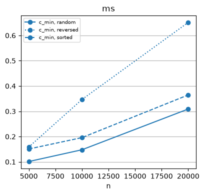
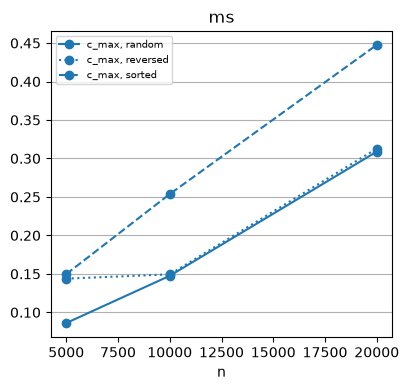
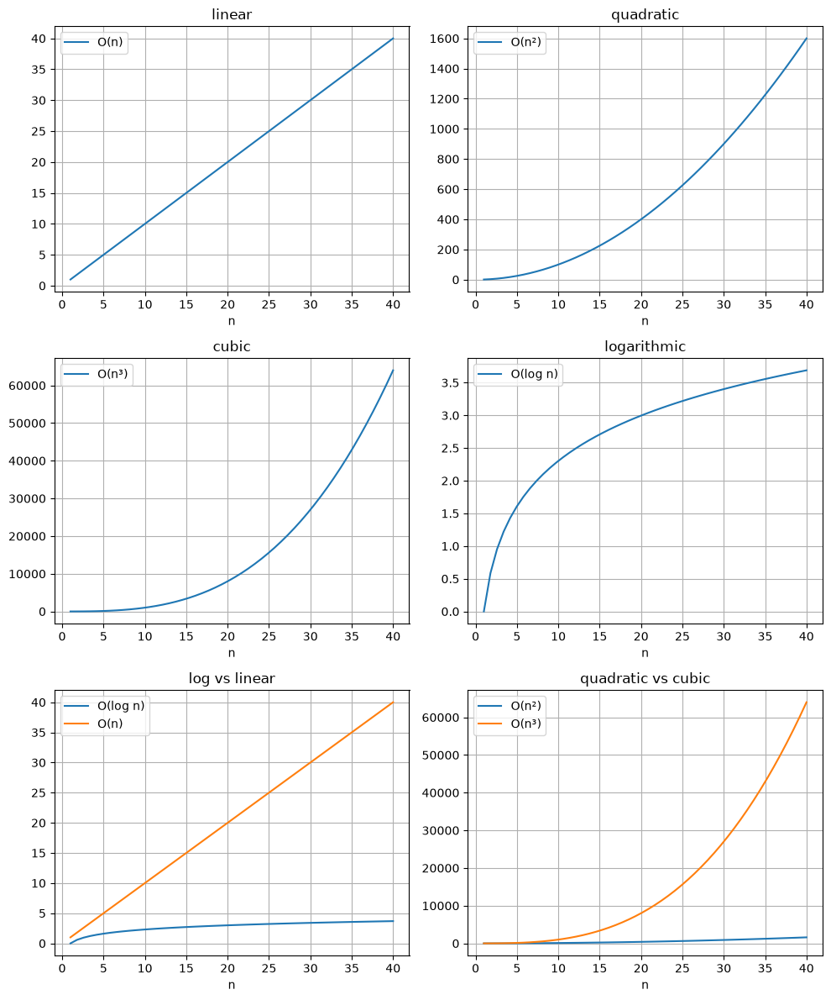

<!-- WARNING: THIS FILE WAS AUTOGENERATED! DO NOT EDIT! -->

## Complexity/Cost Analysis

#### Linear - Sum

------------------------------------------------------------------------

### c_sum

``` python
def c_sum(
    nums
):
```

<details open class="code-fold">
<summary>Exported source</summary>

``` python
def c_sum(nums):
  sum = 0
  for num in nums:
    sum += num
  return sum
```

</details>

``` python
# nums = [random.randint(1, 10000) for _ in range(10000)]
nums = [7,4,2,3,17,18]
f'{c_sum(nums) = }'
f'{sum(nums) = }'
```

    'c_sum(nums) = 51'

    'sum(nums) = 51'

``` python
linear = Cost(repeats=5)
for n in (5_000, 10_000, 20_000):
    _ = linear.run(c_sum, [1] * n)
linear.frame
```

<div>
<style scoped>
    .dataframe tbody tr th:only-of-type {
        vertical-align: middle;
    }
&#10;    .dataframe tbody tr th {
        vertical-align: top;
    }
&#10;    .dataframe thead th {
        text-align: right;
    }
</style>

<table class="dataframe" data-quarto-postprocess="true" data-border="1">
<thead>
<tr style="text-align: right;">
<th data-quarto-table-cell-role="th"></th>
<th data-quarto-table-cell-role="th">algo</th>
<th data-quarto-table-cell-role="th">shape</th>
<th data-quarto-table-cell-role="th">n</th>
<th data-quarto-table-cell-role="th">comparisons</th>
<th data-quarto-table-cell-role="th">predicates</th>
<th data-quarto-table-cell-role="th">swaps</th>
<th data-quarto-table-cell-role="th">ms</th>
</tr>
</thead>
<tbody>
<tr>
<td data-quarto-table-cell-role="th">0</td>
<td>c_sum</td>
<td></td>
<td>5000</td>
<td>None</td>
<td>None</td>
<td>None</td>
<td>0.1036</td>
</tr>
<tr>
<td data-quarto-table-cell-role="th">1</td>
<td>c_sum</td>
<td></td>
<td>10000</td>
<td>None</td>
<td>None</td>
<td>None</td>
<td>0.2736</td>
</tr>
<tr>
<td data-quarto-table-cell-role="th">2</td>
<td>c_sum</td>
<td></td>
<td>20000</td>
<td>None</td>
<td>None</td>
<td>None</td>
<td>0.5570</td>
</tr>
</tbody>
</table>

</div>

#### Linear - min

- Iterator - Walk the sequence
- Assume first one is min.
- Compare and swap min if predicate is true
- Check how many comparison happened

------------------------------------------------------------------------

### c_min

``` python
def c_min(
    seq
):
```

<details open class="code-fold">
<summary>Exported source</summary>

``` python
def c_min(seq):
  #Iterator to walk over the sequence
  it = iter(seq)
  # Assume first element as min
  winner = next(it)
  # walk over rest to compare
  for val in it:
    if val < winner:
      winner = val
  return winner
```

</details>

``` python
f'{c_min(nums) = }'
f'{min(nums) = }'
```

    'c_min(nums) = 2'

    'min(nums) = 2'

``` python
min_linear = Cost(repeats=5)
_ = min_linear.scale(
    c_min,
    args=lambda data: (),
    sizes=(5_000, 10_000, 20_000),
    operations=('comparisons', 'ms'),
)
min_linear.frame
```

<div>
<style scoped>
    .dataframe tbody tr th:only-of-type {
        vertical-align: middle;
    }
&#10;    .dataframe tbody tr th {
        vertical-align: top;
    }
&#10;    .dataframe thead th {
        text-align: right;
    }
</style>

<table class="dataframe" data-quarto-postprocess="true" data-border="1">
<thead>
<tr style="text-align: right;">
<th data-quarto-table-cell-role="th"></th>
<th data-quarto-table-cell-role="th">algo</th>
<th data-quarto-table-cell-role="th">shape</th>
<th data-quarto-table-cell-role="th">n</th>
<th data-quarto-table-cell-role="th">comparisons</th>
<th data-quarto-table-cell-role="th">predicates</th>
<th data-quarto-table-cell-role="th">swaps</th>
<th data-quarto-table-cell-role="th">ms</th>
</tr>
</thead>
<tbody>
<tr>
<td data-quarto-table-cell-role="th">0</td>
<td>c_min</td>
<td>random</td>
<td>5000</td>
<td>4999</td>
<td>None</td>
<td>None</td>
<td>0.1013</td>
</tr>
<tr>
<td data-quarto-table-cell-role="th">1</td>
<td>c_min</td>
<td>sorted</td>
<td>5000</td>
<td>4999</td>
<td>None</td>
<td>None</td>
<td>0.1509</td>
</tr>
<tr>
<td data-quarto-table-cell-role="th">2</td>
<td>c_min</td>
<td>reversed</td>
<td>5000</td>
<td>4999</td>
<td>None</td>
<td>None</td>
<td>0.1588</td>
</tr>
<tr>
<td data-quarto-table-cell-role="th">3</td>
<td>c_min</td>
<td>random</td>
<td>10000</td>
<td>9999</td>
<td>None</td>
<td>None</td>
<td>0.1478</td>
</tr>
<tr>
<td data-quarto-table-cell-role="th">4</td>
<td>c_min</td>
<td>sorted</td>
<td>10000</td>
<td>9999</td>
<td>None</td>
<td>None</td>
<td>0.1958</td>
</tr>
<tr>
<td data-quarto-table-cell-role="th">5</td>
<td>c_min</td>
<td>reversed</td>
<td>10000</td>
<td>9999</td>
<td>None</td>
<td>None</td>
<td>0.3465</td>
</tr>
<tr>
<td data-quarto-table-cell-role="th">6</td>
<td>c_min</td>
<td>random</td>
<td>20000</td>
<td>19999</td>
<td>None</td>
<td>None</td>
<td>0.3089</td>
</tr>
<tr>
<td data-quarto-table-cell-role="th">7</td>
<td>c_min</td>
<td>sorted</td>
<td>20000</td>
<td>19999</td>
<td>None</td>
<td>None</td>
<td>0.3646</td>
</tr>
<tr>
<td data-quarto-table-cell-role="th">8</td>
<td>c_min</td>
<td>reversed</td>
<td>20000</td>
<td>19999</td>
<td>None</td>
<td>None</td>
<td>0.6514</td>
</tr>
</tbody>
</table>

</div>

``` python
min_linear.plot('ms')
```



#### Linear - max

- Iterator - Walk the sequence
- Assume first one is max.
- Compare and swap max if predicate is true
- Check how many comparison happened

------------------------------------------------------------------------

### c_max

``` python
def c_max(
    seq
):
```

<details open class="code-fold">
<summary>Exported source</summary>

``` python
def c_max(seq):
  #Iterator to walk over the sequence
  it = iter(seq)
  # Assume first element as min
  winner = next(it)
  # walk over rest to compare
  for val in it:
    if not val < winner:
      winner = val
  return winner
```

</details>

``` python
f'{c_max(nums) = }'
f'{max(nums) = }'
```

    'c_max(nums) = 18'

    'max(nums) = 18'

``` python
max_linear = Cost(repeats=5)
_ = max_linear.scale(
    c_max,
    args=lambda data: (),
    sizes=(5_000, 10_000, 20_000),
    operations=('comparisons', 'ms'),
)
max_linear.frame
```

<div>
<style scoped>
    .dataframe tbody tr th:only-of-type {
        vertical-align: middle;
    }
&#10;    .dataframe tbody tr th {
        vertical-align: top;
    }
&#10;    .dataframe thead th {
        text-align: right;
    }
</style>

<table class="dataframe" data-quarto-postprocess="true" data-border="1">
<thead>
<tr style="text-align: right;">
<th data-quarto-table-cell-role="th"></th>
<th data-quarto-table-cell-role="th">algo</th>
<th data-quarto-table-cell-role="th">shape</th>
<th data-quarto-table-cell-role="th">n</th>
<th data-quarto-table-cell-role="th">comparisons</th>
<th data-quarto-table-cell-role="th">predicates</th>
<th data-quarto-table-cell-role="th">swaps</th>
<th data-quarto-table-cell-role="th">ms</th>
</tr>
</thead>
<tbody>
<tr>
<td data-quarto-table-cell-role="th">0</td>
<td>c_max</td>
<td>random</td>
<td>5000</td>
<td>4999</td>
<td>None</td>
<td>None</td>
<td>0.0861</td>
</tr>
<tr>
<td data-quarto-table-cell-role="th">1</td>
<td>c_max</td>
<td>sorted</td>
<td>5000</td>
<td>4999</td>
<td>None</td>
<td>None</td>
<td>0.1497</td>
</tr>
<tr>
<td data-quarto-table-cell-role="th">2</td>
<td>c_max</td>
<td>reversed</td>
<td>5000</td>
<td>4999</td>
<td>None</td>
<td>None</td>
<td>0.1438</td>
</tr>
<tr>
<td data-quarto-table-cell-role="th">3</td>
<td>c_max</td>
<td>random</td>
<td>10000</td>
<td>9999</td>
<td>None</td>
<td>None</td>
<td>0.1475</td>
</tr>
<tr>
<td data-quarto-table-cell-role="th">4</td>
<td>c_max</td>
<td>sorted</td>
<td>10000</td>
<td>9999</td>
<td>None</td>
<td>None</td>
<td>0.2537</td>
</tr>
<tr>
<td data-quarto-table-cell-role="th">5</td>
<td>c_max</td>
<td>reversed</td>
<td>10000</td>
<td>9999</td>
<td>None</td>
<td>None</td>
<td>0.1494</td>
</tr>
<tr>
<td data-quarto-table-cell-role="th">6</td>
<td>c_max</td>
<td>random</td>
<td>20000</td>
<td>19999</td>
<td>None</td>
<td>None</td>
<td>0.3089</td>
</tr>
<tr>
<td data-quarto-table-cell-role="th">7</td>
<td>c_max</td>
<td>sorted</td>
<td>20000</td>
<td>19999</td>
<td>None</td>
<td>None</td>
<td>0.4476</td>
</tr>
<tr>
<td data-quarto-table-cell-role="th">8</td>
<td>c_max</td>
<td>reversed</td>
<td>20000</td>
<td>19999</td>
<td>None</td>
<td>None</td>
<td>0.3128</td>
</tr>
</tbody>
</table>

</div>

``` python
max_linear.plot('ms')
```



#### Quadratic - 2 Sum

------------------------------------------------------------------------

### find_2sum

``` python
def find_2sum(
    a, T, pred:function=sums_to
):
```

<details open class="code-fold">
<summary>Exported source</summary>

``` python
from programming_first_principles.predicates import sums_to
def find_2sum(a, T, pred=sums_to):
    for x in a:
        for y in a:
            if pred(x, y, T=T):
                return x, y
    return None, None
```

</details>

``` python
find_2sum(a=[1.5, 2.5, 4.0], T=4.0)
```

    (1.5, 2.5)

``` python
Txn = namedtuple("Txn", ["id", "amount"])

txns = [
    Txn("TXN1001", 4200),
    Txn("TXN1002", 1500),
    Txn("TXN1003", 9800),
    Txn("TXN1004", 3300),
    Txn("TXN1005", 2700),
]
T = 10_000

f'Worst Case: {find_2sum(txns,T,amounts_sum_to) = }'
```

    'Worst Case: find_2sum(txns,T,amounts_sum_to) = (None, None)'

``` python
txns.append(Txn("TXN1006", 5800))
f'Best Case: {find_2sum(txns,T,amounts_sum_to) = }'
```

    "Best Case: find_2sum(txns,T,amounts_sum_to) = (Txn(id='TXN1001', amount=4200), Txn(id='TXN1006', amount=5800))"

#### Quadratic - 3 Sum

------------------------------------------------------------------------

### find_3sum

``` python
def find_3sum(
    a, T, pred:function=sums_to
):
```

<details open class="code-fold">
<summary>Exported source</summary>

``` python
from programming_first_principles.predicates import sums_to
def find_3sum(a, T, pred=sums_to):
    for x in a:
        for y in a:
            for z in a:
                if pred(x, y, z, T=T):
                    return x, y, z
    return None, None, None
```

</details>

``` python
txns_1 = [
    Txn("TXN1001", 4200),
    Txn("TXN1002", 1500),
    Txn("TXN1003", 9800),
    Txn("TXN1004", 3300),
    Txn("TXN1005", 2700),
    Txn("TXN1006", 1000),
]
T = 9200
f'{find_3sum(txns_1, T=T,pred=amounts_sum_to) = }'
```

    'find_3sum(txns_1, T=T,pred=amounts_sum_to) = (None, None, None)'

``` python
txns_1.append(Txn("TXN1007", 1700))
f'{find_3sum(txns_1, T=T,pred=amounts_sum_to) = }'
```

    "find_3sum(txns_1, T=T,pred=amounts_sum_to) = (Txn(id='TXN1001', amount=4200), Txn(id='TXN1004', amount=3300), Txn(id='TXN1007', amount=1700))"

``` python
def many_txns(n):
    return [Txn(f"TXN{i}", 100 + i) for i in range(n)]

timed = Cost(repeats=1)

for n in (40, 80):
    _ = timed.run(find_2sum, many_txns(n), 0, amounts_sum_to,
              operations=('predicates', 'ms'), shape='worst')
```

``` python
timed.frame
```

<div>
<style scoped>
    .dataframe tbody tr th:only-of-type {
        vertical-align: middle;
    }
&#10;    .dataframe tbody tr th {
        vertical-align: top;
    }
&#10;    .dataframe thead th {
        text-align: right;
    }
</style>

<table class="dataframe" data-quarto-postprocess="true" data-border="1">
<thead>
<tr style="text-align: right;">
<th data-quarto-table-cell-role="th"></th>
<th data-quarto-table-cell-role="th">algo</th>
<th data-quarto-table-cell-role="th">shape</th>
<th data-quarto-table-cell-role="th">n</th>
<th data-quarto-table-cell-role="th">comparisons</th>
<th data-quarto-table-cell-role="th">predicates</th>
<th data-quarto-table-cell-role="th">swaps</th>
<th data-quarto-table-cell-role="th">ms</th>
</tr>
</thead>
<tbody>
<tr>
<td data-quarto-table-cell-role="th">0</td>
<td>find_2sum</td>
<td>worst</td>
<td>40</td>
<td>None</td>
<td>1600</td>
<td>None</td>
<td>0.6741</td>
</tr>
<tr>
<td data-quarto-table-cell-role="th">1</td>
<td>find_2sum</td>
<td>worst</td>
<td>80</td>
<td>None</td>
<td>6400</td>
<td>None</td>
<td>2.6539</td>
</tr>
</tbody>
</table>

</div>

``` python
for n in (40, 80):
    _ = timed.run(find_3sum, many_txns(n), 0, amounts_sum_to,
              operations=('predicates', 'ms'), shape='worst')
```

``` python
timed.frame
```

<div>
<style scoped>
    .dataframe tbody tr th:only-of-type {
        vertical-align: middle;
    }
&#10;    .dataframe tbody tr th {
        vertical-align: top;
    }
&#10;    .dataframe thead th {
        text-align: right;
    }
</style>

<table class="dataframe" data-quarto-postprocess="true" data-border="1">
<thead>
<tr style="text-align: right;">
<th data-quarto-table-cell-role="th"></th>
<th data-quarto-table-cell-role="th">algo</th>
<th data-quarto-table-cell-role="th">shape</th>
<th data-quarto-table-cell-role="th">n</th>
<th data-quarto-table-cell-role="th">comparisons</th>
<th data-quarto-table-cell-role="th">predicates</th>
<th data-quarto-table-cell-role="th">swaps</th>
<th data-quarto-table-cell-role="th">ms</th>
</tr>
</thead>
<tbody>
<tr>
<td data-quarto-table-cell-role="th">0</td>
<td>find_2sum</td>
<td>worst</td>
<td>40</td>
<td>None</td>
<td>1600</td>
<td>None</td>
<td>0.6741</td>
</tr>
<tr>
<td data-quarto-table-cell-role="th">1</td>
<td>find_2sum</td>
<td>worst</td>
<td>80</td>
<td>None</td>
<td>6400</td>
<td>None</td>
<td>2.6539</td>
</tr>
<tr>
<td data-quarto-table-cell-role="th">2</td>
<td>find_3sum</td>
<td>worst</td>
<td>40</td>
<td>None</td>
<td>64000</td>
<td>None</td>
<td>30.0644</td>
</tr>
<tr>
<td data-quarto-table-cell-role="th">3</td>
<td>find_3sum</td>
<td>worst</td>
<td>80</td>
<td>None</td>
<td>512000</td>
<td>None</td>
<td>238.4912</td>
</tr>
</tbody>
</table>

</div>

#### Plot

- Linear, Quadratic, Cubic, Logarithm

``` python
ns = np.linspace(1, 40, 50)

fig, axes = plt.subplots(3, 2, figsize=(10, 12))

axes[0, 0].plot(ns, ns, label="O(n)")
axes[0, 0].set_title("linear")

axes[0, 1].plot(ns, ns**2, label="O(n²)")
axes[0, 1].set_title("quadratic")

axes[1, 0].plot(ns, ns**3, label="O(n³)")
axes[1, 0].set_title("cubic")

axes[1, 1].plot(ns, np.log(ns), label="O(log n)")
axes[1, 1].set_title("logarithmic")

axes[2, 0].plot(ns, np.log(ns), label="O(log n)")
axes[2, 0].plot(ns, ns, label="O(n)")
axes[2, 0].set_title("log vs linear")

axes[2, 1].plot(ns, ns**2, label="O(n²)")
axes[2, 1].plot(ns, ns**3, label="O(n³)")
axes[2, 1].set_title("quadratic vs cubic")

for row in axes:
    for ax in row:
        ax.set_xlabel("n")
        ax.legend()
        ax.grid(True)

plt.tight_layout()
plt.show()
```


