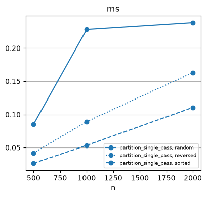
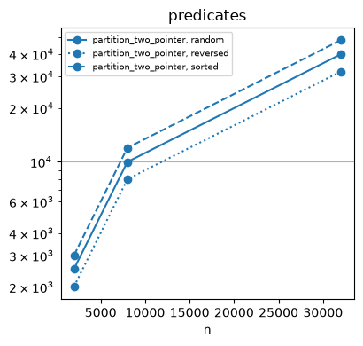
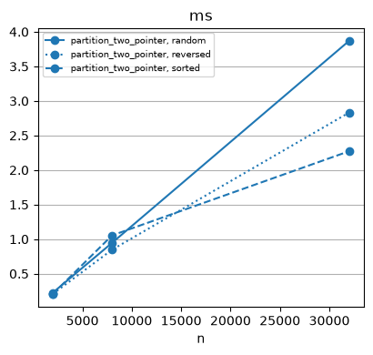
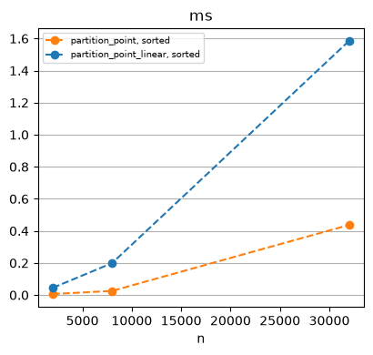
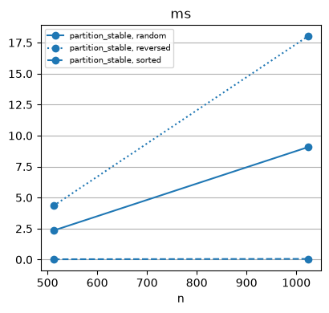

# Partition


<!-- WARNING: THIS FILE WAS AUTOGENERATED! DO NOT EDIT! -->

``` python
print(inspect.getsource(above_35))
```

    def above_35(score):
        """Return whether score is 35 or higher."""
        return score >= 35

#### Single Pass

- Lomuto

------------------------------------------------------------------------

### partition_single_pass

``` python
def partition_single_pass(
    a, first, last, pred
):
```

<details open class="code-fold">
<summary>Exported source</summary>

``` python
from programming_first_principles.algorithms.rearrange import swap

def partition_single_pass(a, first, last, pred):
    n = first
    for i in range(first, last):
        if pred(a[i]):
            if n != i:
                swap(a, n, i)
            n += 1
    return n
```

</details>

``` python
scores_sp = list(scores_out_of_100)
pp1 = partition_single_pass(scores_sp,0,len(scores_sp), above_35)
f'Good: {scores_sp[:pp1] = }'
f'Bad: {scores_sp[pp1:] = }'
```

    'Good: scores_sp[:pp1] = [40, 35, 80, 75, 80]'

    'Bad: scores_sp[pp1:] = [5, 5, 10]'

``` python
scores_pp2 = list(scores)
pp2 = partition_single_pass(scores_pp2,0,len(scores_pp2), above_35)
f'{pp2 = }'
f'Good: {scores_pp2[:pp2] = }'
f'Bad: {scores_pp2[pp2:] = }'
```

    'pp2 = 63'

    'Good: scores_pp2[:pp2] = [91, 92, 35, 35, 40, 80, 95, 39, 50, 63, 92, 44, 43, 100, 63, 42, 88, 67, 92, 96, 85, 86, 80, 58, 59, 42, 94, 72, 46, 97, 59, 47, 93, 47, 94, 75, 67, 48, 64, 66, 61, 56, 72, 41, 75, 62, 73, 52, 82, 54, 37, 53, 96, 42, 77, 62, 68, 68, 40, 95, 66, 41, 50]'

    'Bad: scores_pp2[pp2:] = [4, 8, 1, 30, 9, 34, 16, 2, 28, 32, 10, 30, 14, 14, 15, 23, 7, 14, 6, 16, 14, 26, 12, 13, 3, 13, 6, 19, 10, 32, 29, 18, 22, 1, 25, 28, 32]'

``` python
scores_sp_cost = [40, 10, 35, 5, 80, 75, 5, 80]
predicates = Cost(repeats=1)
_ = predicates.run(partition_single_pass, scores_sp_cost,0,len(scores_sp_cost),above_35, operations=('predicates','swaps','ms'))
predicates.frame
```

<div>
<style scoped>
    .dataframe tbody tr th:only-of-type {
        vertical-align: middle;
    }
&#10;    .dataframe tbody tr th {
        vertical-align: top;
    }
&#10;    .dataframe thead th {
        text-align: right;
    }
</style>

<table class="dataframe" data-quarto-postprocess="true" data-border="1">
<thead>
<tr style="text-align: right;">
<th data-quarto-table-cell-role="th"></th>
<th data-quarto-table-cell-role="th">algo</th>
<th data-quarto-table-cell-role="th">shape</th>
<th data-quarto-table-cell-role="th">n</th>
<th data-quarto-table-cell-role="th">comparisons</th>
<th data-quarto-table-cell-role="th">predicates</th>
<th data-quarto-table-cell-role="th">swaps</th>
<th data-quarto-table-cell-role="th">ms</th>
</tr>
</thead>
<tbody>
<tr>
<td data-quarto-table-cell-role="th">0</td>
<td>partition_single_pass</td>
<td></td>
<td>8</td>
<td>None</td>
<td>8</td>
<td>4</td>
<td>0.0057</td>
</tr>
</tbody>
</table>

</div>

``` python
single_pass = Cost(repeats=5, seed=0)
_ = single_pass.scale([partition_single_pass], args=lambda data: (0, len(data), below_5000), operations=('predicates','swaps','ms'))

single_pass.frame
```

<div>
<style scoped>
    .dataframe tbody tr th:only-of-type {
        vertical-align: middle;
    }
&#10;    .dataframe tbody tr th {
        vertical-align: top;
    }
&#10;    .dataframe thead th {
        text-align: right;
    }
</style>

<table class="dataframe" data-quarto-postprocess="true" data-border="1">
<thead>
<tr style="text-align: right;">
<th data-quarto-table-cell-role="th"></th>
<th data-quarto-table-cell-role="th">algo</th>
<th data-quarto-table-cell-role="th">shape</th>
<th data-quarto-table-cell-role="th">n</th>
<th data-quarto-table-cell-role="th">comparisons</th>
<th data-quarto-table-cell-role="th">predicates</th>
<th data-quarto-table-cell-role="th">swaps</th>
<th data-quarto-table-cell-role="th">ms</th>
</tr>
</thead>
<tbody>
<tr>
<td data-quarto-table-cell-role="th">0</td>
<td>partition_single_pass</td>
<td>random</td>
<td>500</td>
<td>None</td>
<td>500</td>
<td>258</td>
<td>0.0854</td>
</tr>
<tr>
<td data-quarto-table-cell-role="th">1</td>
<td>partition_single_pass</td>
<td>sorted</td>
<td>500</td>
<td>None</td>
<td>500</td>
<td>0</td>
<td>0.0265</td>
</tr>
<tr>
<td data-quarto-table-cell-role="th">2</td>
<td>partition_single_pass</td>
<td>reversed</td>
<td>500</td>
<td>None</td>
<td>500</td>
<td>258</td>
<td>0.0419</td>
</tr>
<tr>
<td data-quarto-table-cell-role="th">3</td>
<td>partition_single_pass</td>
<td>random</td>
<td>1000</td>
<td>None</td>
<td>1000</td>
<td>501</td>
<td>0.2281</td>
</tr>
<tr>
<td data-quarto-table-cell-role="th">4</td>
<td>partition_single_pass</td>
<td>sorted</td>
<td>1000</td>
<td>None</td>
<td>1000</td>
<td>0</td>
<td>0.0534</td>
</tr>
<tr>
<td data-quarto-table-cell-role="th">5</td>
<td>partition_single_pass</td>
<td>reversed</td>
<td>1000</td>
<td>None</td>
<td>1000</td>
<td>501</td>
<td>0.0892</td>
</tr>
<tr>
<td data-quarto-table-cell-role="th">6</td>
<td>partition_single_pass</td>
<td>random</td>
<td>2000</td>
<td>None</td>
<td>2000</td>
<td>988</td>
<td>0.2383</td>
</tr>
<tr>
<td data-quarto-table-cell-role="th">7</td>
<td>partition_single_pass</td>
<td>sorted</td>
<td>2000</td>
<td>None</td>
<td>2000</td>
<td>0</td>
<td>0.1106</td>
</tr>
<tr>
<td data-quarto-table-cell-role="th">8</td>
<td>partition_single_pass</td>
<td>reversed</td>
<td>2000</td>
<td>None</td>
<td>2000</td>
<td>991</td>
<td>0.1631</td>
</tr>
</tbody>
</table>

</div>

``` python
single_pass.plot('ms')
```



#### Two Pointer

- Hoare

------------------------------------------------------------------------

### partition_two_pointer

``` python
def partition_two_pointer(
    a, first, last, pred
):
```

<details open class="code-fold">
<summary>Exported source</summary>

``` python
from programming_first_principles.algorithms.rearrange import swap
def partition_two_pointer(a,first,last, pred):
    lo, hi = first, last - 1
    while lo <= hi:
        if pred(a[lo]):
            lo += 1
        else:
            if not pred(a[hi]):
                hi -= 1
            else:
                swap(a, lo, hi)
                lo += 1
                hi -= 1
    return lo
```

</details>

``` python
scores_2p = list(scores_out_of_100)
two_p_pp1 = partition_two_pointer(scores_2p, 0, len(scores_2p), above_35)
f'{two_p_pp1 = }'
f'Passed: {scores_2p[:two_p_pp1] = }'
f'Failed: {scores_2p[two_p_pp1:] = }'
```

    'two_p_pp1 = 5'

    'Passed: scores_2p[:two_p_pp1] = [40, 80, 35, 75, 80]'

    'Failed: scores_2p[two_p_pp1:] = [5, 5, 10]'

``` python
scores_d = list(scores_out_of_100)
two_p_pp2 = partition_two_pointer(scores_d, 0, len(scores_d), above_35)
f'{two_p_pp2 = }'
f'Passed: {scores_d[:two_p_pp2] = }'
f'Failed: {scores_d[two_p_pp2:] = }'
```

    'two_p_pp2 = 5'

    'Passed: scores_d[:two_p_pp2] = [40, 80, 35, 75, 80]'

    'Failed: scores_d[two_p_pp2:] = [5, 5, 10]'

``` python
scores_2p_cost = [40, 10, 35, 5, 80, 75, 5, 80]
predicates = Cost(repeats=1)
_ = predicates.run(partition_two_pointer, scores_2p_cost, 0, len(scores_2p_cost), above_35, operations=('predicates','ms','swaps'))
predicates.frame
```

<div>
<style scoped>
    .dataframe tbody tr th:only-of-type {
        vertical-align: middle;
    }
&#10;    .dataframe tbody tr th {
        vertical-align: top;
    }
&#10;    .dataframe thead th {
        text-align: right;
    }
</style>

<table class="dataframe" data-quarto-postprocess="true" data-border="1">
<thead>
<tr style="text-align: right;">
<th data-quarto-table-cell-role="th"></th>
<th data-quarto-table-cell-role="th">algo</th>
<th data-quarto-table-cell-role="th">shape</th>
<th data-quarto-table-cell-role="th">n</th>
<th data-quarto-table-cell-role="th">comparisons</th>
<th data-quarto-table-cell-role="th">predicates</th>
<th data-quarto-table-cell-role="th">swaps</th>
<th data-quarto-table-cell-role="th">ms</th>
</tr>
</thead>
<tbody>
<tr>
<td data-quarto-table-cell-role="th">0</td>
<td>partition_two_pointer</td>
<td></td>
<td>8</td>
<td>None</td>
<td>9</td>
<td>2</td>
<td>0.0036</td>
</tr>
</tbody>
</table>

</div>

``` python
two_pointer = Cost(repeats=1, seed=0, sizes=(2_000, 8_000, 32_000))
_ = two_pointer.scale([partition_two_pointer], 
                        args=lambda data: (0, len(data), below_5000),
                        operations=('predicates','swaps','ms'))
two_pointer.frame
```

<div>
<style scoped>
    .dataframe tbody tr th:only-of-type {
        vertical-align: middle;
    }
&#10;    .dataframe tbody tr th {
        vertical-align: top;
    }
&#10;    .dataframe thead th {
        text-align: right;
    }
</style>

<table class="dataframe" data-quarto-postprocess="true" data-border="1">
<thead>
<tr style="text-align: right;">
<th data-quarto-table-cell-role="th"></th>
<th data-quarto-table-cell-role="th">algo</th>
<th data-quarto-table-cell-role="th">shape</th>
<th data-quarto-table-cell-role="th">n</th>
<th data-quarto-table-cell-role="th">comparisons</th>
<th data-quarto-table-cell-role="th">predicates</th>
<th data-quarto-table-cell-role="th">swaps</th>
<th data-quarto-table-cell-role="th">ms</th>
</tr>
</thead>
<tbody>
<tr>
<td data-quarto-table-cell-role="th">0</td>
<td>partition_two_pointer</td>
<td>random</td>
<td>2000</td>
<td>None</td>
<td>2521</td>
<td>483</td>
<td>0.2245</td>
</tr>
<tr>
<td data-quarto-table-cell-role="th">1</td>
<td>partition_two_pointer</td>
<td>sorted</td>
<td>2000</td>
<td>None</td>
<td>3004</td>
<td>0</td>
<td>0.2055</td>
</tr>
<tr>
<td data-quarto-table-cell-role="th">2</td>
<td>partition_two_pointer</td>
<td>reversed</td>
<td>2000</td>
<td>None</td>
<td>2008</td>
<td>996</td>
<td>0.2067</td>
</tr>
<tr>
<td data-quarto-table-cell-role="th">3</td>
<td>partition_two_pointer</td>
<td>random</td>
<td>8000</td>
<td>None</td>
<td>9990</td>
<td>1994</td>
<td>0.9462</td>
</tr>
<tr>
<td data-quarto-table-cell-role="th">4</td>
<td>partition_two_pointer</td>
<td>sorted</td>
<td>8000</td>
<td>None</td>
<td>11984</td>
<td>0</td>
<td>1.0539</td>
</tr>
<tr>
<td data-quarto-table-cell-role="th">5</td>
<td>partition_two_pointer</td>
<td>reversed</td>
<td>8000</td>
<td>None</td>
<td>8000</td>
<td>3984</td>
<td>0.8470</td>
</tr>
<tr>
<td data-quarto-table-cell-role="th">6</td>
<td>partition_two_pointer</td>
<td>random</td>
<td>32000</td>
<td>None</td>
<td>39983</td>
<td>7971</td>
<td>3.8695</td>
</tr>
<tr>
<td data-quarto-table-cell-role="th">7</td>
<td>partition_two_pointer</td>
<td>sorted</td>
<td>32000</td>
<td>None</td>
<td>47954</td>
<td>0</td>
<td>2.2725</td>
</tr>
<tr>
<td data-quarto-table-cell-role="th">8</td>
<td>partition_two_pointer</td>
<td>reversed</td>
<td>32000</td>
<td>None</td>
<td>32000</td>
<td>15954</td>
<td>2.8319</td>
</tr>
</tbody>
</table>

</div>

``` python
two_pointer.plot('predicates')
```



``` python
two_pointer.plot('ms')
```



#### Custom Data Type

``` python
Student = namedtuple("Student", ["name", "score"])

def student_above_35(s):
    return above_35(s.score)

students = [
    Student("Ana", 22),
    Student("Ben", 41),
    Student("Cai", 35),
    Student("Diya", 90),
    Student("Eli", 18),
    Student("Far", 67),
]

n = partition_two_pointer(students,0, len(students), student_above_35)

f'Passed: {students[:n]}'
```

    "Passed: [Student(name='Far', score=67), Student(name='Ben', score=41), Student(name='Cai', score=35), Student(name='Diya', score=90)]"

#### Is Partitioned

------------------------------------------------------------------------

### is_partitioned

``` python
def is_partitioned(
    a, first, last, pred
):
```

<details open class="code-fold">
<summary>Exported source</summary>

``` python
from programming_first_principles.algorithms.find import find_if, find_if_not

def is_partitioned(a, first, last, pred):
    i = find_if_not(a, first, last, pred)
    j = find_if(a, i, last, pred )
    return j == last
```

</details>

``` python
scores_isp = list(scores_out_of_100)

f'{is_partitioned(scores_isp, 0, len(scores_isp), above_35) = }'
partition_point1 = partition_single_pass(scores_isp,0,len(scores_isp), above_35)
f'{scores_isp = }'

f'{is_partitioned(scores_isp, 0, len(scores_isp), above_35) = }'
```

    'is_partitioned(scores_isp, 0, len(scores_isp), above_35) = False'

    'scores_isp = [40, 35, 80, 75, 80, 5, 5, 10]'

    'is_partitioned(scores_isp, 0, len(scores_isp), above_35) = True'

``` python
good = [40, 60, 75, 80, 20, 5, 3, 10]
raw = [5, 40, 3, 10, 20, 60, 75, 80]

isp = Cost(repeats=1)
_ = isp.run(is_partitioned, good, 0, len(good), above_35,
            shape='partitioned', operations=('predicates', 'ms'))
_ = isp.run(is_partitioned, raw, 0, len(raw), above_35,
            shape='broken', operations=('predicates', 'ms'))
isp.frame
```

<div>
<style scoped>
    .dataframe tbody tr th:only-of-type {
        vertical-align: middle;
    }
&#10;    .dataframe tbody tr th {
        vertical-align: top;
    }
&#10;    .dataframe thead th {
        text-align: right;
    }
</style>

<table class="dataframe" data-quarto-postprocess="true" data-border="1">
<thead>
<tr style="text-align: right;">
<th data-quarto-table-cell-role="th"></th>
<th data-quarto-table-cell-role="th">algo</th>
<th data-quarto-table-cell-role="th">shape</th>
<th data-quarto-table-cell-role="th">n</th>
<th data-quarto-table-cell-role="th">comparisons</th>
<th data-quarto-table-cell-role="th">predicates</th>
<th data-quarto-table-cell-role="th">swaps</th>
<th data-quarto-table-cell-role="th">ms</th>
</tr>
</thead>
<tbody>
<tr>
<td data-quarto-table-cell-role="th">0</td>
<td>is_partitioned</td>
<td>partitioned</td>
<td>8</td>
<td>None</td>
<td>9</td>
<td>None</td>
<td>0.0027</td>
</tr>
<tr>
<td data-quarto-table-cell-role="th">1</td>
<td>is_partitioned</td>
<td>broken</td>
<td>8</td>
<td>None</td>
<td>3</td>
<td>None</td>
<td>0.0027</td>
</tr>
</tbody>
</table>

</div>

#### Partition Point

------------------------------------------------------------------------

### partition_point_linear

``` python
def partition_point_linear(
    a, first, last, pred
):
```

<details open class="code-fold">
<summary>Exported source</summary>

``` python
from programming_first_principles.algorithms.find import find_if_not
def partition_point_linear(a, first, last, pred):
    return find_if_not(a, first, last, pred)
```

</details>

``` python
good = [40, 60, 75, 80, 20, 5, 3, 10]
raw = [5, 40, 3, 10, 20, 60, 75, 80]

f'{partition_point_linear(good, 0, len(good), above_35) = }'
f'{partition_point_linear(raw, 0, len(raw), above_35) = }'
```

    'partition_point_linear(good, 0, len(good), above_35) = 4'

    'partition_point_linear(raw, 0, len(raw), above_35) = 0'

``` python
front = [5, 3, 10, 20, 8, 1, 2, 4]
mid = [40, 60, 75, 80, 20, 5, 3, 10]
end = [40, 60, 75, 80, 90, 41, 35, 50]

ppl = Cost(repeats=1)
_ = ppl.run(partition_point_linear, front, 0, len(front), above_35,
           shape='point 0', operations=('predicates', 'ms'))
_ = ppl.run(partition_point_linear, mid, 0, len(mid), above_35,
           shape='point 4', operations=('predicates', 'ms'))
_ = ppl.run(partition_point_linear, end, 0, len(end), above_35,
           shape='point 8', operations=('predicates', 'ms'))
ppl.frame
```

<div>
<style scoped>
    .dataframe tbody tr th:only-of-type {
        vertical-align: middle;
    }
&#10;    .dataframe tbody tr th {
        vertical-align: top;
    }
&#10;    .dataframe thead th {
        text-align: right;
    }
</style>

<table class="dataframe" data-quarto-postprocess="true" data-border="1">
<thead>
<tr style="text-align: right;">
<th data-quarto-table-cell-role="th"></th>
<th data-quarto-table-cell-role="th">algo</th>
<th data-quarto-table-cell-role="th">shape</th>
<th data-quarto-table-cell-role="th">n</th>
<th data-quarto-table-cell-role="th">comparisons</th>
<th data-quarto-table-cell-role="th">predicates</th>
<th data-quarto-table-cell-role="th">swaps</th>
<th data-quarto-table-cell-role="th">ms</th>
</tr>
</thead>
<tbody>
<tr>
<td data-quarto-table-cell-role="th">0</td>
<td>partition_point_linear</td>
<td>point 0</td>
<td>8</td>
<td>None</td>
<td>1</td>
<td>None</td>
<td>0.0024</td>
</tr>
<tr>
<td data-quarto-table-cell-role="th">1</td>
<td>partition_point_linear</td>
<td>point 4</td>
<td>8</td>
<td>None</td>
<td>5</td>
<td>None</td>
<td>0.0022</td>
</tr>
<tr>
<td data-quarto-table-cell-role="th">2</td>
<td>partition_point_linear</td>
<td>point 8</td>
<td>8</td>
<td>None</td>
<td>8</td>
<td>None</td>
<td>0.0015</td>
</tr>
</tbody>
</table>

</div>

------------------------------------------------------------------------

### partition_point

``` python
def partition_point(
    a, first, last, pred
):
```

*Precondition: is_partitioned(a, first, last, pred).* Returns the
partition point of \[first, last).

<details open class="code-fold">
<summary>Exported source</summary>

``` python
def partition_point(a, first, last, pred):
    """
    Precondition: is_partitioned(a, first, last, pred).
    Returns the partition point of [first, last).
    """
    while first != last:
        middle = first + (last - first) // 2
        if pred(a[middle]):
            first = middle + 1
        else:
            last = middle
    return first
```

</details>

``` python
good = [40, 60, 75, 80, 20, 5, 3, 10]
raw = [5, 40, 3, 10, 20, 60, 75, 80]
f'{is_partitioned(good, 0, len(good), above_35) = }'
f'{partition_point(good, 0, len(good), above_35) = }'

f'{is_partitioned(raw, 0, len(raw), above_35) = }'
f'{partition_point(raw, 0, len(raw), above_35) = }'
```

    'is_partitioned(good, 0, len(good), above_35) = True'

    'partition_point(good, 0, len(good), above_35) = 4'

    'is_partitioned(raw, 0, len(raw), above_35) = False'

    'partition_point(raw, 0, len(raw), above_35) = 2'

``` python
front = [5, 3, 10, 20, 8, 1, 2, 4]
mid = [40, 60, 75, 80, 20, 5, 3, 10]
end = [40, 60, 75, 80, 90, 41, 35, 50]

pp = Cost(repeats=1)
_ = pp.run(partition_point, front, 0, len(front), above_35,
           shape='point 0', operations=('predicates', 'ms'))
_ = pp.run(partition_point, mid, 0, len(mid), above_35,
           shape='point 4', operations=('predicates', 'ms'))
_ = pp.run(partition_point, end, 0, len(end), above_35,
           shape='point 8', operations=('predicates', 'ms'))
pp.frame
```

<div>
<style scoped>
    .dataframe tbody tr th:only-of-type {
        vertical-align: middle;
    }
&#10;    .dataframe tbody tr th {
        vertical-align: top;
    }
&#10;    .dataframe thead th {
        text-align: right;
    }
</style>

<table class="dataframe" data-quarto-postprocess="true" data-border="1">
<thead>
<tr style="text-align: right;">
<th data-quarto-table-cell-role="th"></th>
<th data-quarto-table-cell-role="th">algo</th>
<th data-quarto-table-cell-role="th">shape</th>
<th data-quarto-table-cell-role="th">n</th>
<th data-quarto-table-cell-role="th">comparisons</th>
<th data-quarto-table-cell-role="th">predicates</th>
<th data-quarto-table-cell-role="th">swaps</th>
<th data-quarto-table-cell-role="th">ms</th>
</tr>
</thead>
<tbody>
<tr>
<td data-quarto-table-cell-role="th">0</td>
<td>partition_point</td>
<td>point 0</td>
<td>8</td>
<td>None</td>
<td>4</td>
<td>None</td>
<td>0.0026</td>
</tr>
<tr>
<td data-quarto-table-cell-role="th">1</td>
<td>partition_point</td>
<td>point 4</td>
<td>8</td>
<td>None</td>
<td>3</td>
<td>None</td>
<td>0.0040</td>
</tr>
<tr>
<td data-quarto-table-cell-role="th">2</td>
<td>partition_point</td>
<td>point 8</td>
<td>8</td>
<td>None</td>
<td>3</td>
<td>None</td>
<td>0.0019</td>
</tr>
</tbody>
</table>

</div>

``` python
point = Cost(repeats=5, seed=0, sizes=(2_000, 8_000, 32_000))
_ = point.scale(
    [partition_point_linear, partition_point],
    args=lambda data: (0, len(data), below_5000),
    operations=('ms',),
)
point.plot('ms', frame=point.frame[point.frame['shape'] == 'sorted'])
```



``` python
from programming_first_principles.algorithms.rearrange import rotate

def partition_stable(a, first, last, pred):
    n = first
    for i in range(first, last):
        if pred(a[i]):
            if n != i:
                rotate(a, n, i, i + 1)
            n += 1
    return n
```

``` python
scores_stablep = list(scores_out_of_100)
pp_s1 = partition_stable(scores_stablep, 0, len(scores_stablep), above_35)
f'{pp_s1 = }'
f'Good: {scores_stablep[:pp_s1] = }'
f'Bad: {scores_stablep[pp_s1:] = }'
```

    'pp_s1 = 5'

    'Good: scores_stablep[:pp_s1] = [40, 35, 80, 75, 80]'

    'Bad: scores_stablep[pp_s1:] = [10, 5, 5]'

``` python
scores_sp_cost = list(scores_out_of_100)
stable = Cost(repeats=1)
_ = stable.run(partition_stable, scores_sp_cost, 0, len(scores_sp_cost), above_35, operations=('predicates', 'swaps', 'ms'))
stable.frame
```

<div>
<style scoped>
    .dataframe tbody tr th:only-of-type {
        vertical-align: middle;
    }
&#10;    .dataframe tbody tr th {
        vertical-align: top;
    }
&#10;    .dataframe thead th {
        text-align: right;
    }
</style>

<table class="dataframe" data-quarto-postprocess="true" data-border="1">
<thead>
<tr style="text-align: right;">
<th data-quarto-table-cell-role="th"></th>
<th data-quarto-table-cell-role="th">algo</th>
<th data-quarto-table-cell-role="th">shape</th>
<th data-quarto-table-cell-role="th">n</th>
<th data-quarto-table-cell-role="th">comparisons</th>
<th data-quarto-table-cell-role="th">predicates</th>
<th data-quarto-table-cell-role="th">swaps</th>
<th data-quarto-table-cell-role="th">ms</th>
</tr>
</thead>
<tbody>
<tr>
<td data-quarto-table-cell-role="th">0</td>
<td>partition_stable</td>
<td></td>
<td>8</td>
<td>None</td>
<td>8</td>
<td>8</td>
<td>0.0054</td>
</tr>
</tbody>
</table>

</div>

``` python
stable = Cost(repeats=5, seed=0, sizes=(512, 1024))
_ = stable.scale(
    [partition_stable],
    args=lambda data: (0, len(data), below_5000),
    operations=('predicates', 'swaps', 'ms'),
)
stable.frame
```

<div>
<style scoped>
    .dataframe tbody tr th:only-of-type {
        vertical-align: middle;
    }
&#10;    .dataframe tbody tr th {
        vertical-align: top;
    }
&#10;    .dataframe thead th {
        text-align: right;
    }
</style>

<table class="dataframe" data-quarto-postprocess="true" data-border="1">
<thead>
<tr style="text-align: right;">
<th data-quarto-table-cell-role="th"></th>
<th data-quarto-table-cell-role="th">algo</th>
<th data-quarto-table-cell-role="th">shape</th>
<th data-quarto-table-cell-role="th">n</th>
<th data-quarto-table-cell-role="th">comparisons</th>
<th data-quarto-table-cell-role="th">predicates</th>
<th data-quarto-table-cell-role="th">swaps</th>
<th data-quarto-table-cell-role="th">ms</th>
</tr>
</thead>
<tbody>
<tr>
<td data-quarto-table-cell-role="th">0</td>
<td>partition_stable</td>
<td>random</td>
<td>512</td>
<td>None</td>
<td>512</td>
<td>32233</td>
<td>2.3414</td>
</tr>
<tr>
<td data-quarto-table-cell-role="th">1</td>
<td>partition_stable</td>
<td>sorted</td>
<td>512</td>
<td>None</td>
<td>512</td>
<td>0</td>
<td>0.0279</td>
</tr>
<tr>
<td data-quarto-table-cell-role="th">2</td>
<td>partition_stable</td>
<td>reversed</td>
<td>512</td>
<td>None</td>
<td>512</td>
<td>65500</td>
<td>4.3352</td>
</tr>
<tr>
<td data-quarto-table-cell-role="th">3</td>
<td>partition_stable</td>
<td>random</td>
<td>1024</td>
<td>None</td>
<td>1024</td>
<td>128946</td>
<td>9.0758</td>
</tr>
<tr>
<td data-quarto-table-cell-role="th">4</td>
<td>partition_stable</td>
<td>sorted</td>
<td>1024</td>
<td>None</td>
<td>1024</td>
<td>0</td>
<td>0.0573</td>
</tr>
<tr>
<td data-quarto-table-cell-role="th">5</td>
<td>partition_stable</td>
<td>reversed</td>
<td>1024</td>
<td>None</td>
<td>1024</td>
<td>262095</td>
<td>18.0324</td>
</tr>
</tbody>
</table>

</div>

``` python
stable.plot('ms')
```



``` python
from programming_first_principles.algorithms.rearrange import swap
def v_partition_single_pass(b, pred):
    n = 0
    a = list(b)
    for i in range(len(a)):
        val  = a[i]
        predicate = pred(val)
        if predicate:
            if n != i:
                swap(a, n, i)
            n += 1
        array_state = a[:]
    return n, a
# scores_vsp = [5, 40, 3, 10, 20, 60,75,80]
# LiveEdit.inspect_run(v_partition_single_pass, scores_vsp, above_35)
```
