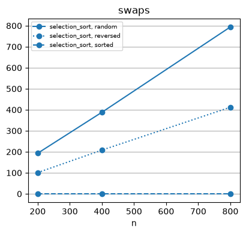

# Adjacent Exchange


<!-- WARNING: THIS FILE WAS AUTOGENERATED! DO NOT EDIT! -->

#### sort2

------------------------------------------------------------------------

### sort2

``` python
def sort2(
    x, y
):
```

<details open class="code-fold">
<summary>Exported source</summary>

``` python
from programming_first_principles.ordering import out_of_order

def sort2(x, y):
    if out_of_order(x, y):
        return y, x
    return x, y
```

</details>

``` python
f'already sorted: {sort2(5, 10) = }'
f'equal: {sort2(5, 5) = }'
f'out of order: {sort2(10, 5) = }'
```

    'already sorted: sort2(5, 10) = (5, 10)'

    'equal: sort2(5, 5) = (5, 5)'

    'out of order: sort2(10, 5) = (5, 10)'

#### sort3

------------------------------------------------------------------------

### sort3

``` python
def sort3(
    x, y, z
):
```

<details open class="code-fold">
<summary>Exported source</summary>

``` python
def sort3(x, y, z):
    x, y = sort2(x, y)
    y, z = sort2(y, z)
    x, y = sort2(x, y)
    return x, y, z
```

</details>

``` python
f'already sorted: {sort3(5, 10, 35) = }'
f'all equal: {sort3(5, 5, 5) = }'
```

    'already sorted: sort3(5, 10, 35) = (5, 10, 35)'

    'all equal: sort3(5, 5, 5) = (5, 5, 5)'

``` python
f'equals already in place: {sort3(5, 5, 10) = }'
f'the 10 moves to the end: {sort3(10, 5, 5) = }'
f'the middle is out of order: {sort3(5, 10, 5) = }'
f'equals at the ends: {sort3(10, 5, 10) = }'
```

    'equals already in place: sort3(5, 5, 10) = (5, 5, 10)'

    'the 10 moves to the end: sort3(10, 5, 5) = (5, 5, 10)'

    'the middle is out of order: sort3(5, 10, 5) = (5, 5, 10)'

    'equals at the ends: sort3(10, 5, 10) = (5, 10, 10)'

``` python
f'only the first pair: {sort3(10, 5, 35) = }'
f'only the second pair: {sort3(5, 35, 10) = }'
f'reversed: {sort3(35, 10, 5) = }'
f'largest starts first and finishes last: {sort3(35, 5, 10) = }'
```

    'only the first pair: sort3(10, 5, 35) = (5, 10, 35)'

    'only the second pair: sort3(5, 35, 10) = (5, 10, 35)'

    'reversed: sort3(35, 10, 5) = (5, 10, 35)'

    'largest starts first and finishes last: sort3(35, 5, 10) = (5, 10, 35)'

#### Bubble Sort

------------------------------------------------------------------------

### bubble_sort

``` python
def bubble_sort(
    a, first, last
):
```

<details open class="code-fold">
<summary>Exported source</summary>

``` python
def bubble_pass(a, first, last):
    for i in range(first, last - 1):
        a[i], a[i + 1] = sort2(a[i], a[i + 1])

def bubble_sort(a, first, last):
    while last - first > 1:
        bubble_pass(a, first, last)
        last -= 1
```

</details>

------------------------------------------------------------------------

### bubble_pass

``` python
def bubble_pass(
    a, first, last
):
```

``` python
a = list(scores_out_of_100)
bubble_pass(a, 0, len(a))
f'one pass, largest finishes last: {a = }'

b = list(scores_out_of_100)
f'Before: {b = }, {is_sorted(b, 0, len(b)) = }'
bubble_sort(b, 0, len(b))
f'After: {b = }, {is_sorted(b, 0, len(b)) = }'
```

    'one pass, largest finishes last: a = [10, 35, 5, 40, 75, 5, 80, 80]'

    'Before: b = [40, 10, 35, 5, 80, 75, 5, 80], is_sorted(b, 0, len(b)) = False'

    'After: b = [5, 5, 10, 35, 40, 75, 80, 80], is_sorted(b, 0, len(b)) = True'

``` python
scores_bub = list(scores_out_of_100)
bub = Cost(repeats=1)
_ = bub.run(bubble_sort, scores_bub.copy(), 0, len(scores_bub),
        name='bubble_sort', shape='scores',
        operations=('comparisons', 'swaps', 'ms'))
bub.frame
```

<div>
<style scoped>
    .dataframe tbody tr th:only-of-type {
        vertical-align: middle;
    }
&#10;    .dataframe tbody tr th {
        vertical-align: top;
    }
&#10;    .dataframe thead th {
        text-align: right;
    }
</style>

<table class="dataframe" data-quarto-postprocess="true" data-border="1">
<thead>
<tr style="text-align: right;">
<th data-quarto-table-cell-role="th"></th>
<th data-quarto-table-cell-role="th">algo</th>
<th data-quarto-table-cell-role="th">shape</th>
<th data-quarto-table-cell-role="th">n</th>
<th data-quarto-table-cell-role="th">comparisons</th>
<th data-quarto-table-cell-role="th">predicates</th>
<th data-quarto-table-cell-role="th">swaps</th>
<th data-quarto-table-cell-role="th">ms</th>
</tr>
</thead>
<tbody>
<tr>
<td data-quarto-table-cell-role="th">0</td>
<td>bubble_sort</td>
<td>scores</td>
<td>8</td>
<td>28</td>
<td>None</td>
<td>28</td>
<td>0.007</td>
</tr>
</tbody>
</table>

</div>

``` python
bub_scale = Cost(repeats=3, sizes=(200, 400, 800))
bub_scale.scale(bubble_sort, operations=('comparisons', 'swaps', 'ms'))
```

<div>
<style scoped>
    .dataframe tbody tr th:only-of-type {
        vertical-align: middle;
    }
&#10;    .dataframe tbody tr th {
        vertical-align: top;
    }
&#10;    .dataframe thead th {
        text-align: right;
    }
</style>

<table class="dataframe" data-quarto-postprocess="true" data-border="1">
<thead>
<tr style="text-align: right;">
<th data-quarto-table-cell-role="th"></th>
<th data-quarto-table-cell-role="th">algo</th>
<th data-quarto-table-cell-role="th">shape</th>
<th data-quarto-table-cell-role="th">n</th>
<th data-quarto-table-cell-role="th">comparisons</th>
<th data-quarto-table-cell-role="th">predicates</th>
<th data-quarto-table-cell-role="th">swaps</th>
<th data-quarto-table-cell-role="th">ms</th>
</tr>
</thead>
<tbody>
<tr>
<td data-quarto-table-cell-role="th">0</td>
<td>bubble_sort</td>
<td>random</td>
<td>200</td>
<td>19900</td>
<td>None</td>
<td>19900</td>
<td>2.2480</td>
</tr>
<tr>
<td data-quarto-table-cell-role="th">1</td>
<td>bubble_sort</td>
<td>sorted</td>
<td>200</td>
<td>19900</td>
<td>None</td>
<td>19900</td>
<td>4.0994</td>
</tr>
<tr>
<td data-quarto-table-cell-role="th">2</td>
<td>bubble_sort</td>
<td>reversed</td>
<td>200</td>
<td>19900</td>
<td>None</td>
<td>19900</td>
<td>2.6019</td>
</tr>
<tr>
<td data-quarto-table-cell-role="th">3</td>
<td>bubble_sort</td>
<td>random</td>
<td>400</td>
<td>79800</td>
<td>None</td>
<td>79800</td>
<td>10.6119</td>
</tr>
<tr>
<td data-quarto-table-cell-role="th">4</td>
<td>bubble_sort</td>
<td>sorted</td>
<td>400</td>
<td>79800</td>
<td>None</td>
<td>79800</td>
<td>16.2877</td>
</tr>
<tr>
<td data-quarto-table-cell-role="th">5</td>
<td>bubble_sort</td>
<td>reversed</td>
<td>400</td>
<td>79800</td>
<td>None</td>
<td>79800</td>
<td>8.0654</td>
</tr>
<tr>
<td data-quarto-table-cell-role="th">6</td>
<td>bubble_sort</td>
<td>random</td>
<td>800</td>
<td>319600</td>
<td>None</td>
<td>319600</td>
<td>36.5457</td>
</tr>
<tr>
<td data-quarto-table-cell-role="th">7</td>
<td>bubble_sort</td>
<td>sorted</td>
<td>800</td>
<td>319600</td>
<td>None</td>
<td>319600</td>
<td>34.6952</td>
</tr>
<tr>
<td data-quarto-table-cell-role="th">8</td>
<td>bubble_sort</td>
<td>reversed</td>
<td>800</td>
<td>319600</td>
<td>None</td>
<td>319600</td>
<td>34.0204</td>
</tr>
</tbody>
</table>

</div>

#### min_element

------------------------------------------------------------------------

### min_element

``` python
def min_element(
    seq, first, last
):
```

*Returns the index of the minimum element in the range \[first, last).*

<details open class="code-fold">
<summary>Exported source</summary>

``` python
from programming_first_principles.ordering import out_of_order

def min_element(seq, first, last):
    """
    Returns the index of the minimum element in the range [first, last).
    """
    if first == last:
        return last
    min_index = first
    for i in range(first + 1, last):
        if out_of_order(seq[min_index],seq[i]):
            min_index = i
    return min_index
```

</details>

``` python
scores_me = list(scores_out_of_100)
f'{scores_me = }'
f'{min_element(scores_me, 0, len(scores_me)) = }'
f'{scores_me[3] = }, {scores_me[6] = }'
f'{scores_me[4:7] = }, {min_element(scores_me, 4, 7) = }'
f'{scores_me[4:4] = }, {min_element(scores_me, 4, 4) = }'
```

    'scores_me = [40, 10, 35, 5, 80, 75, 5, 80]'

    'min_element(scores_me, 0, len(scores_me)) = 3'

    'scores_me[3] = 5, scores_me[6] = 5'

    'scores_me[4:7] = [80, 75, 5], min_element(scores_me, 4, 7) = 6'

    'scores_me[4:4] = [], min_element(scores_me, 4, 4) = 4'

``` python
min_m = Cost(repeats=1)
scores_min_m = list(scores_out_of_100)
f'{scores_min_m = }'
_ = min_m.run(min_element, scores_min_m, 0, len(scores_min_m),
                name='min_element', 
                shape='full range', 
                operations=('comparisons','ms'))
_ = min_m.run(min_element, scores_min_m, 4, 7,
                name='min_element', 
                shape='range of 3', 
                operations=('comparisons','ms'))
_ = min_m.run(min_element, scores_min_m, 4, 4,
                name='min_element', 
                shape='empty', 
                operations=('comparisons','ms'))
min_m.frame
```

    'scores_min_m = [40, 10, 35, 5, 80, 75, 5, 80]'

<div>
<style scoped>
    .dataframe tbody tr th:only-of-type {
        vertical-align: middle;
    }
&#10;    .dataframe tbody tr th {
        vertical-align: top;
    }
&#10;    .dataframe thead th {
        text-align: right;
    }
</style>

<table class="dataframe" data-quarto-postprocess="true" data-border="1">
<thead>
<tr style="text-align: right;">
<th data-quarto-table-cell-role="th"></th>
<th data-quarto-table-cell-role="th">algo</th>
<th data-quarto-table-cell-role="th">shape</th>
<th data-quarto-table-cell-role="th">n</th>
<th data-quarto-table-cell-role="th">comparisons</th>
<th data-quarto-table-cell-role="th">predicates</th>
<th data-quarto-table-cell-role="th">swaps</th>
<th data-quarto-table-cell-role="th">ms</th>
</tr>
</thead>
<tbody>
<tr>
<td data-quarto-table-cell-role="th">0</td>
<td>min_element</td>
<td>full range</td>
<td>8</td>
<td>7</td>
<td>None</td>
<td>None</td>
<td>0.0025</td>
</tr>
<tr>
<td data-quarto-table-cell-role="th">1</td>
<td>min_element</td>
<td>range of 3</td>
<td>8</td>
<td>2</td>
<td>None</td>
<td>None</td>
<td>0.0134</td>
</tr>
<tr>
<td data-quarto-table-cell-role="th">2</td>
<td>min_element</td>
<td>empty</td>
<td>8</td>
<td>0</td>
<td>None</td>
<td>None</td>
<td>0.0010</td>
</tr>
</tbody>
</table>

</div>

------------------------------------------------------------------------

### min_element_py

``` python
def min_element_py(
    seq, first, last
):
```

<details open class="code-fold">
<summary>Exported source</summary>

``` python
def min_element_py(seq, first, last):
    return min(range(first, last), key=partial(getitem, seq), default=last)
```

</details>

#### max_element

------------------------------------------------------------------------

### max_element

``` python
def max_element(
    seq, first, last
):
```

*Returns the index of the maximum element in the range \[first, last).*

<details open class="code-fold">
<summary>Exported source</summary>

``` python
from programming_first_principles.ordering import in_order
def max_element(seq, first, last):
    """ 
    Returns the index of the maximum element in the range [first, last).
    """
    if first == last:
        return last
    max_index = first
    for i in range(first + 1, last):
        if in_order(seq[max_index],seq[i]):
            max_index = i
    return max_index
```

</details>

``` python
scores_max_e = list(scores_out_of_100)
f'{scores_max_e = }'

f'{max_element(scores_max_e, 0, len(scores_max_e)) = }'
f'{scores_max_e[4] = }, {scores_max_e[-1] = }'
f'{scores_max_e[:5] = }, {max_element(scores_max_e, 0, 5) = }'
f'{scores_max_e[4:4] = }, {max_element(scores_max_e, 4, 4) = }'
```

    'scores_max_e = [40, 10, 35, 5, 80, 75, 5, 80]'

    'max_element(scores_max_e, 0, len(scores_max_e)) = 7'

    'scores_max_e[4] = 80, scores_max_e[-1] = 80'

    'scores_max_e[:5] = [40, 10, 35, 5, 80], max_element(scores_max_e, 0, 5) = 4'

    'scores_max_e[4:4] = [], max_element(scores_max_e, 4, 4) = 4'

``` python
max_m = Cost(repeats=1)
scores_max_m = list(scores_out_of_100)
f'{scores_max_m = }'
_ = max_m.run(max_element, scores_max_m, 0, len(scores_max_m),
              name='max_element', shape='full range', operations=('comparisons', 'ms'))
_ = max_m.run(max_element, scores_max_m, 0, 5,
              name='max_element', shape='range of 5', operations=('comparisons', 'ms'))
_ = max_m.run(max_element, scores_max_m, 4, 4,
              name='max_element', shape='empty', operations=('comparisons', 'ms'))
max_m.frame
```

    'scores_max_m = [40, 10, 35, 5, 80, 75, 5, 80]'

<div>
<style scoped>
    .dataframe tbody tr th:only-of-type {
        vertical-align: middle;
    }
&#10;    .dataframe tbody tr th {
        vertical-align: top;
    }
&#10;    .dataframe thead th {
        text-align: right;
    }
</style>

<table class="dataframe" data-quarto-postprocess="true" data-border="1">
<thead>
<tr style="text-align: right;">
<th data-quarto-table-cell-role="th"></th>
<th data-quarto-table-cell-role="th">algo</th>
<th data-quarto-table-cell-role="th">shape</th>
<th data-quarto-table-cell-role="th">n</th>
<th data-quarto-table-cell-role="th">comparisons</th>
<th data-quarto-table-cell-role="th">predicates</th>
<th data-quarto-table-cell-role="th">swaps</th>
<th data-quarto-table-cell-role="th">ms</th>
</tr>
</thead>
<tbody>
<tr>
<td data-quarto-table-cell-role="th">0</td>
<td>max_element</td>
<td>full range</td>
<td>8</td>
<td>7</td>
<td>None</td>
<td>None</td>
<td>0.0025</td>
</tr>
<tr>
<td data-quarto-table-cell-role="th">1</td>
<td>max_element</td>
<td>range of 5</td>
<td>8</td>
<td>4</td>
<td>None</td>
<td>None</td>
<td>0.0015</td>
</tr>
<tr>
<td data-quarto-table-cell-role="th">2</td>
<td>max_element</td>
<td>empty</td>
<td>8</td>
<td>0</td>
<td>None</td>
<td>None</td>
<td>0.0006</td>
</tr>
</tbody>
</table>

</div>

``` python
def max_element_py(seq, first, last):
    return max(range(last - 1, first - 1, -1), key=partial(getitem, seq), default=last)
```

#### minmax_element

------------------------------------------------------------------------

### minmax_element

``` python
def minmax_element(
    seq, first, last
):
```

*Returns the index of the minimum and maximum elements in the range
\[first, last).*

<details open class="code-fold">
<summary>Exported source</summary>

``` python
from programming_first_principles.ordering import out_of_order, in_order
def minmax_element(seq, first, last):
    """
    Returns the index of the minimum and maximum elements in the range [first, last).
    """
    if first == last:
        return last, last
    lo = hi = first
    for i in range(first + 1, last):
        if out_of_order(seq[lo], seq[i]):
            lo = i
        if in_order(seq[hi], seq[i]):
            hi = i
    return lo, hi
```

</details>

``` python
scores_minmax_e = list(scores_out_of_100)
f'{scores_minmax_e = }'

f'{minmax_element(scores_minmax_e, 0, len(scores_minmax_e)) = }'

f'{scores_minmax_e[:5] = }, {minmax_element(scores_minmax_e, 0, 5) = }'
f'{scores_minmax_e[4:4] = }, {minmax_element(scores_minmax_e, 4, 4) = }'
```

    'scores_minmax_e = [40, 10, 35, 5, 80, 75, 5, 80]'

    'minmax_element(scores_minmax_e, 0, len(scores_minmax_e)) = (3, 7)'

    'scores_minmax_e[:5] = [40, 10, 35, 5, 80], minmax_element(scores_minmax_e, 0, 5) = (3, 4)'

    'scores_minmax_e[4:4] = [], minmax_element(scores_minmax_e, 4, 4) = (4, 4)'

#### Selection Sort

- Selection sort always does n(n − 1) / 2 comparisons. Swaps stay
  between 0 and n − 1.
- **sorted**, 0 swaps (min_element keeps the leftmost minimum, and a
  nondecreasing range already has it at i)
- **reversed, distinct values**: n − 1 swaps

------------------------------------------------------------------------

### selection_sort

``` python
def selection_sort(
    a, first, last
):
```

<details open class="code-fold">
<summary>Exported source</summary>

``` python
from programming_first_principles.algorithms.rearrange import swap
from programming_first_principles.algorithms.sort import min_element, is_sorted

def selection_sort(a, first, last):
    for i in range(first, last):
        m = min_element(a, i, last)
        if m != i:
            swap(a, i, m)
```

</details>

``` python
a = list(scores_out_of_100)
f'Before: {a = }, {is_sorted(a, 0, len(a)) = }'
selection_sort(a, 0, len(a))
f'After: {a = }, {is_sorted(a, 0, len(a)) = }'

sub = list(scores_out_of_100)
f'Before: {sub = }'
selection_sort(sub, 2, 6)
f'After:  {sub = }'
```

    'Before: a = [40, 10, 35, 5, 80, 75, 5, 80], is_sorted(a, 0, len(a)) = False'

    'After: a = [5, 5, 10, 35, 40, 75, 80, 80], is_sorted(a, 0, len(a)) = True'

    'Before: sub = [40, 10, 35, 5, 80, 75, 5, 80]'

    'After:  sub = [40, 10, 5, 35, 75, 80, 5, 80]'

``` python
scores_ss = list(scores_out_of_100)
sel = Cost(repeats=1)
_ = sel.run(selection_sort, scores_ss.copy(), 0, len(scores_ss),
        name='selection_sort', shape='scores_ss',
        operations=('comparisons', 'swaps', 'ms'))
sel.frame
```

<div>
<style scoped>
    .dataframe tbody tr th:only-of-type {
        vertical-align: middle;
    }
&#10;    .dataframe tbody tr th {
        vertical-align: top;
    }
&#10;    .dataframe thead th {
        text-align: right;
    }
</style>

<table class="dataframe" data-quarto-postprocess="true" data-border="1">
<thead>
<tr style="text-align: right;">
<th data-quarto-table-cell-role="th"></th>
<th data-quarto-table-cell-role="th">algo</th>
<th data-quarto-table-cell-role="th">shape</th>
<th data-quarto-table-cell-role="th">n</th>
<th data-quarto-table-cell-role="th">comparisons</th>
<th data-quarto-table-cell-role="th">predicates</th>
<th data-quarto-table-cell-role="th">swaps</th>
<th data-quarto-table-cell-role="th">ms</th>
</tr>
</thead>
<tbody>
<tr>
<td data-quarto-table-cell-role="th">0</td>
<td>selection_sort</td>
<td>scores_ss</td>
<td>8</td>
<td>28</td>
<td>None</td>
<td>5</td>
<td>0.0061</td>
</tr>
</tbody>
</table>

</div>

``` python
sel = Cost(repeats=3, sizes=(200, 400, 800))
sel.scale(selection_sort, operations=('comparisons', 'swaps', 'ms'))
```

<div>
<style scoped>
    .dataframe tbody tr th:only-of-type {
        vertical-align: middle;
    }
&#10;    .dataframe tbody tr th {
        vertical-align: top;
    }
&#10;    .dataframe thead th {
        text-align: right;
    }
</style>

<table class="dataframe" data-quarto-postprocess="true" data-border="1">
<thead>
<tr style="text-align: right;">
<th data-quarto-table-cell-role="th"></th>
<th data-quarto-table-cell-role="th">algo</th>
<th data-quarto-table-cell-role="th">shape</th>
<th data-quarto-table-cell-role="th">n</th>
<th data-quarto-table-cell-role="th">comparisons</th>
<th data-quarto-table-cell-role="th">predicates</th>
<th data-quarto-table-cell-role="th">swaps</th>
<th data-quarto-table-cell-role="th">ms</th>
</tr>
</thead>
<tbody>
<tr>
<td data-quarto-table-cell-role="th">0</td>
<td>selection_sort</td>
<td>random</td>
<td>200</td>
<td>19900</td>
<td>None</td>
<td>193</td>
<td>1.0666</td>
</tr>
<tr>
<td data-quarto-table-cell-role="th">1</td>
<td>selection_sort</td>
<td>sorted</td>
<td>200</td>
<td>19900</td>
<td>None</td>
<td>0</td>
<td>0.8002</td>
</tr>
<tr>
<td data-quarto-table-cell-role="th">2</td>
<td>selection_sort</td>
<td>reversed</td>
<td>200</td>
<td>19900</td>
<td>None</td>
<td>101</td>
<td>1.0356</td>
</tr>
<tr>
<td data-quarto-table-cell-role="th">3</td>
<td>selection_sort</td>
<td>random</td>
<td>400</td>
<td>79800</td>
<td>None</td>
<td>388</td>
<td>5.1456</td>
</tr>
<tr>
<td data-quarto-table-cell-role="th">4</td>
<td>selection_sort</td>
<td>sorted</td>
<td>400</td>
<td>79800</td>
<td>None</td>
<td>0</td>
<td>3.6134</td>
</tr>
<tr>
<td data-quarto-table-cell-role="th">5</td>
<td>selection_sort</td>
<td>reversed</td>
<td>400</td>
<td>79800</td>
<td>None</td>
<td>208</td>
<td>4.5243</td>
</tr>
<tr>
<td data-quarto-table-cell-role="th">6</td>
<td>selection_sort</td>
<td>random</td>
<td>800</td>
<td>319600</td>
<td>None</td>
<td>794</td>
<td>14.8516</td>
</tr>
<tr>
<td data-quarto-table-cell-role="th">7</td>
<td>selection_sort</td>
<td>sorted</td>
<td>800</td>
<td>319600</td>
<td>None</td>
<td>0</td>
<td>13.8470</td>
</tr>
<tr>
<td data-quarto-table-cell-role="th">8</td>
<td>selection_sort</td>
<td>reversed</td>
<td>800</td>
<td>319600</td>
<td>None</td>
<td>412</td>
<td>15.0172</td>
</tr>
</tbody>
</table>

</div>

``` python
sel.plot('swaps')
```


