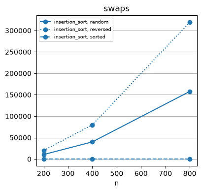

# Sorting by Insertion


<!-- WARNING: THIS FILE WAS AUTOGENERATED! DO NOT EDIT! -->

#### Sorting by Insertion

------------------------------------------------------------------------

### insertion_sort

``` python
def insertion_sort(
    a, first, last
):
```

<details open class="code-fold">
<summary>Exported source</summary>

``` python
from programming_first_principles.algorithms.rearrange import rotate
from bisect import bisect_right
def insertion_sort(a, first, last):
    for i in range(first + 1, last):
        at = bisect_right(a, a[i], first, i)
        if at != i:
            rotate(a, at, i, i + 1)
```

</details>

``` python
b = list(scores_out_of_100)
f'Before: {b = }, {is_sorted(b, 0, len(b)) = }'
insertion_sort(b, 0, len(b))
f'After:  {b = }, {is_sorted(b, 0, len(b)) = }'
```

    'Before: b = [40, 10, 35, 5, 80, 75, 5, 80], is_sorted(b, 0, len(b)) = False'

    'After:  b = [5, 5, 10, 35, 40, 75, 80, 80], is_sorted(b, 0, len(b)) = True'

``` python
scores_ins = list(scores_out_of_100)
f'Before: {scores_ins = }'
ins = Cost(repeats=1)
_ = ins.run(insertion_sort, scores_ins.copy(), 0, len(scores_ins),
        name='insertion_sort', shape='scores_ins',
        operations=('comparisons', 'swaps', 'ms'))
ins.frame
```

    'Before: scores_ins = [40, 10, 35, 5, 80, 75, 5, 80]'

<div>
<style scoped>
    .dataframe tbody tr th:only-of-type {
        vertical-align: middle;
    }
&#10;    .dataframe tbody tr th {
        vertical-align: top;
    }
&#10;    .dataframe thead th {
        text-align: right;
    }
</style>

<table class="dataframe" data-quarto-postprocess="true" data-border="1">
<thead>
<tr style="text-align: right;">
<th data-quarto-table-cell-role="th"></th>
<th data-quarto-table-cell-role="th">algo</th>
<th data-quarto-table-cell-role="th">shape</th>
<th data-quarto-table-cell-role="th">n</th>
<th data-quarto-table-cell-role="th">comparisons</th>
<th data-quarto-table-cell-role="th">predicates</th>
<th data-quarto-table-cell-role="th">swaps</th>
<th data-quarto-table-cell-role="th">ms</th>
</tr>
</thead>
<tbody>
<tr>
<td data-quarto-table-cell-role="th">0</td>
<td>insertion_sort</td>
<td>scores_ins</td>
<td>8</td>
<td>16</td>
<td>None</td>
<td>11</td>
<td>0.0072</td>
</tr>
</tbody>
</table>

</div>

``` python
ins_scale = Cost(repeats=1, sizes=(200, 400, 800))
_ = ins_scale.scale(insertion_sort, operations=('comparisons', 'swaps', 'ms'))
ins_scale.frame
```

<div>
<style scoped>
    .dataframe tbody tr th:only-of-type {
        vertical-align: middle;
    }
&#10;    .dataframe tbody tr th {
        vertical-align: top;
    }
&#10;    .dataframe thead th {
        text-align: right;
    }
</style>

<table class="dataframe" data-quarto-postprocess="true" data-border="1">
<thead>
<tr style="text-align: right;">
<th data-quarto-table-cell-role="th"></th>
<th data-quarto-table-cell-role="th">algo</th>
<th data-quarto-table-cell-role="th">shape</th>
<th data-quarto-table-cell-role="th">n</th>
<th data-quarto-table-cell-role="th">comparisons</th>
<th data-quarto-table-cell-role="th">predicates</th>
<th data-quarto-table-cell-role="th">swaps</th>
<th data-quarto-table-cell-role="th">ms</th>
</tr>
</thead>
<tbody>
<tr>
<td data-quarto-table-cell-role="th">0</td>
<td>insertion_sort</td>
<td>random</td>
<td>200</td>
<td>1255</td>
<td>None</td>
<td>10508</td>
<td>0.9206</td>
</tr>
<tr>
<td data-quarto-table-cell-role="th">1</td>
<td>insertion_sort</td>
<td>sorted</td>
<td>200</td>
<td>1153</td>
<td>None</td>
<td>0</td>
<td>0.0211</td>
</tr>
<tr>
<td data-quarto-table-cell-role="th">2</td>
<td>insertion_sort</td>
<td>reversed</td>
<td>200</td>
<td>1345</td>
<td>None</td>
<td>19898</td>
<td>1.2883</td>
</tr>
<tr>
<td data-quarto-table-cell-role="th">3</td>
<td>insertion_sort</td>
<td>random</td>
<td>400</td>
<td>2906</td>
<td>None</td>
<td>39980</td>
<td>5.0158</td>
</tr>
<tr>
<td data-quarto-table-cell-role="th">4</td>
<td>insertion_sort</td>
<td>sorted</td>
<td>400</td>
<td>2698</td>
<td>None</td>
<td>0</td>
<td>0.0451</td>
</tr>
<tr>
<td data-quarto-table-cell-role="th">5</td>
<td>insertion_sort</td>
<td>reversed</td>
<td>400</td>
<td>3089</td>
<td>None</td>
<td>79785</td>
<td>7.9439</td>
</tr>
<tr>
<td data-quarto-table-cell-role="th">6</td>
<td>insertion_sort</td>
<td>random</td>
<td>800</td>
<td>6603</td>
<td>None</td>
<td>157799</td>
<td>10.7029</td>
</tr>
<tr>
<td data-quarto-table-cell-role="th">7</td>
<td>insertion_sort</td>
<td>sorted</td>
<td>800</td>
<td>6187</td>
<td>None</td>
<td>0</td>
<td>0.1810</td>
</tr>
<tr>
<td data-quarto-table-cell-role="th">8</td>
<td>insertion_sort</td>
<td>reversed</td>
<td>800</td>
<td>6976</td>
<td>None</td>
<td>319575</td>
<td>20.0990</td>
</tr>
</tbody>
</table>

</div>

``` python
ins_scale.plot('swaps')
```


